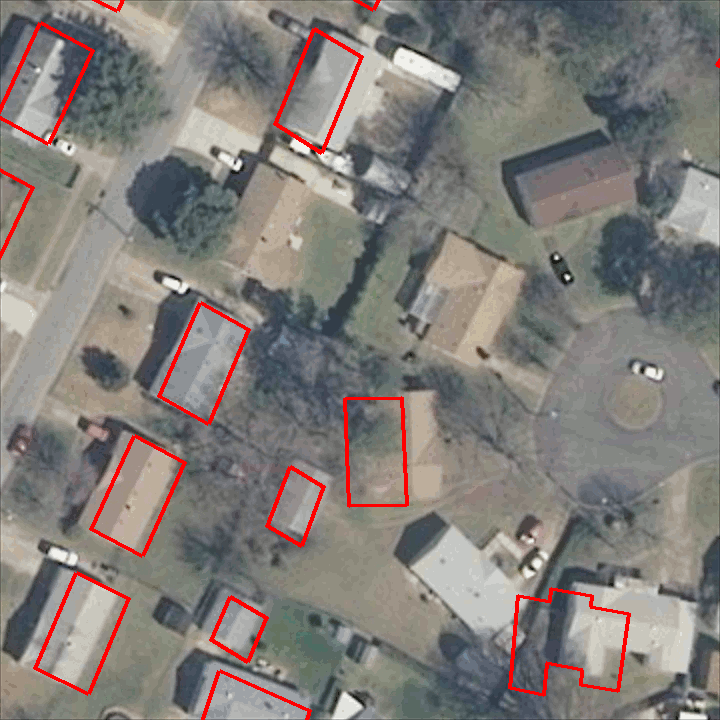

# Aligning and Updating Cadaster Maps with Remote Sensing Images

<p align="center">
    
</p>

This is the official code for the paper:

**Aligning and Updating Cadaster Maps with Aerial Images by Multi-Task, Multi-Resolution Deep Learning**\
[Nicolas Girard](https://www-sop.inria.fr/members/Nicolas.Girard/),
[Guillaume Charpiat](https://www.lri.fr/~gcharpia/),
[Yuliya Tarabalka](https://www-sop.inria.fr/members/Yuliya.Tarabalka/)\
ACCV 2018\
**[[Paper](https://www-sop.inria.fr/members/Nicolas.Girard/pdf/Girard_2018_ACCV_paper.pdf)] [[Supplementary materials](https://www-sop.inria.fr/members/Nicolas.Girard/pdf/Girard_2018_ACCV_suppmat.pdf)]**

It can be adapted to implement the method of our previous paper:

**Multimodal image alignment through a multiscale chain of neural networks with application to remote sensing**\
[Armand Zampieri](https://www.linkedin.com/in/armand-zampieri-43a177ab/?locale=en_US),
[Guillaume Charpiat](https://www.lri.fr/~gcharpia/),
[Nicolas Girard](https://www-sop.inria.fr/members/Nicolas.Girard/),
[Yuliya Tarabalka](https://www-sop.inria.fr/members/Yuliya.Tarabalka/)\
ECCV 2018\
**[[Paper](https://hal.inria.fr/hal-01849389/file/2691.pdf)]**

### Python environment

The code uses a few Python libraries such as Tensorflow, etc.
The docker image
[lydorn/anaconda-tensorflow-geo](docker/lydorn/anaconda-tensorflow-geo) has all the needed dependencies.
See the instructions in the [docker](docker) folder to install docker and build that image.

### Download pre-trained networks

4 pe-trained networks are available, one for each downsampling factor.\
You can either: Execute the download script [download_pretrained.py](projects/mapalign/mapalign_multires/download_pretrained.py)\
Or: manually download the zipfile at https://www-sop.inria.fr/members/Nicolas.Girard/downloads/mapalignment/runs.zip,
extract and place the runs folder in the [projects/mapalign/mapalign_multires](projects/mapalign/mapalign_multires) folder
so that the folder structure is [projects/mapalign/mapalign_multires/runs](projects/mapalign/mapalign_multires/runs)

### Train your own models

#### Download datasets

Three datasets are used for training and have individual instructions for downloading in their respective folder:
- [Inria Aerial Image Dataset](data/AerialImageDataset)
- [Aerial imagery object identification dataset for building and road detection, and building height estimation](data/bradbury_buildings_roads_height_dataset)
- [Mapping Challenge from CrowdAI Dataset](data/mapping_challenge_dataset)

#### Pre-process datasets

All scripts for dataset handling relative to the alignment project are located in the [dataset_utils](projects/mapalign/dataset_utils) folder.
See the README in that folder for instructions on dataset pre-processing.

#### Or use your own dataset

If you want to use your own dataset, I suggest you to write a ```read.py``` script based on this one: [read.py](data/AerialImageDataset/read.py).
Then write a ```process_dataset.py``` script based on this one: [preprocess_aerial_image_multires.py](projects/mapalign/dataset_utils/preprocess_aerial_image_multires.py).
The ```process_dataset.py``` script should take as input the images and ground truth data read by the ```read.py``` script and split them in patches that are then stored in TFRecord format for training.
Once the TFRecords are created, you will have to add their path to the [config.py](projects/mapalign/mapalign_multires/config.py) script in the TFRECORDS_DIR_LIST list.

### Perform inference and training of models

The useful scripts and instructions for performing inference and training of the models are in the [mapalign_multires](projects/mapalign/mapalign_multires) folder.

### If you use this code for your own research, please cite:

```
@InProceedings{Girard_2018_ACCV,
author = {Girard, Nicolas and Charpiat, Guillaume and Tarabalka, Yuliya},
title = {Aligning and Updating Cadaster Maps with Aerial Images by Multi-Task, Multi-Resolution Deep Learning},
booktitle = {The Asian Conference on Computer Vision (ACCV)},
month = {December},
year = {2018}
}

@InProceedings{Zampieri_2018_ECCV,
author = {Zampieri, Armand and Charpiat, Guillaume and Girard, Nicolas and Tarabalka, Yuliya},
title = {Multimodal image alignment through a multiscale chain of neural networks with application to remote sensing},
booktitle = {The European Conference on Computer Vision (ECCV)},
month = {September},
year = {2018}
}
```